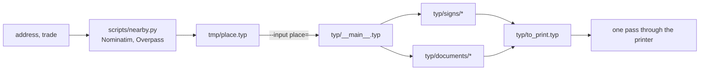

# Architecture

One door's worth of paper: a street plate to cut out, a landlord's attestation,
and the plaques of the neighbour and of the competitors nearby.

A place is data, and the sources are not — nothing under `typ/` names a place
file. `typ/__main__.typ` takes the one handed to it on the command line, asserts
its shape, and is what every sheet imports.

`.claude/skills/prepare-verif` walks that left to right.
