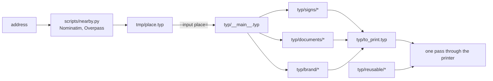

# Architecture

One door's worth of paper: a street plate to cut out, the landlord's attestation
and rent invoice, the plaques of the neighbour and of the other businesses
nearby, and what the business hangs and hands out itself.

A place is data, and the sources are not — nothing under `typ/` names a place
file. `typ/__main__.typ` takes the one handed to it on the command line, asserts
its shape, and is what a specialized sheet imports.

Which splits the sources in two, and a build is the query that picks a half:

| | `nix build .#typ` | `nix build "path:.#<place>"` |
| --- | --- | --- |
| asks for | the stock, before there is a door | one door's `to_print.pdf` |
| gets | the cut-out alphabet, the plate blue, `reusable/` | every sheet, specialized |
| how it picks | the documents whose imports never reach `typ/__main__.typ` | all of them |

Which half a document falls in is read off its imports rather than its path, so a
sheet joins the stock by not asking for an address. `typ/reusable/` is where the
ones that could never ask live — signs a business hangs whoever it is, drawn in
every language it knows and printed one page at a time.

Anything the stock draws with has to be place-free too, so a drawing sits apart
from the sheet that specializes it: `signs/doorplate.typ` is the plate and the
board, `signs/plaques.typ` is this address tiled across them.

`.claude/skills/prepare-verif` walks that left to right.
