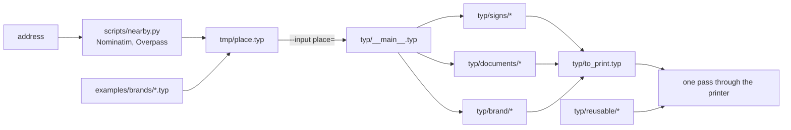

# Architecture

One door's worth of paper: a street plate, the landlord's attestation and rent
invoice, the plaques of the neighbour and of the other businesses nearby, and
what the business hangs and hands out itself.

A place is data, and the sources are not — nothing under `typ/` names a place
file. `typ/__main__.typ` takes the one handed to it on the command line, asserts
its shape, and is what a specialized sheet imports.

A business outlives the door it is behind and takes several at once, so it is a
file of its own under `examples/brands/`: the name, who signs for it, how it is
reached, what it is coloured in, and the mark it is drawn with — a file under
`assets/logos/`, or its own initial in a ring when it has none, which says
nothing about the trade and so is a placeholder (`docs/logos/`). A place imports one
and adds what its own door decides — the trade and territory line, the number it
answers on when it has one, how many of each to print — so `brand` reaches a
sheet as one dictionary. What can be checked from outside is optional and has no
default: `phone` and `site` draw only where they are known, since a line that
does not ring reads worse than one that is not there.

Which splits the sources in two, and a build is the query that picks a half:

| | `nix build .#typ` | `nix build "path:.#<place>"` |
| --- | --- | --- |
| asks for | the stock, before there is a door | one door's `to_print.pdf` |
| gets | the plate blue, `reusable/` | every sheet, specialized |
| how it picks | the documents whose imports never reach `typ/__main__.typ` | all of them |

Which half a document falls in is read off its imports rather than its path, so a
sheet joins the stock by not asking for an address. `typ/reusable/` is where the
ones that could never ask live — signs a business hangs whoever it is. A sheet is
what goes on a wall, so a language is a file of its own rather than a page to
leaf past: `<sign>.<lang>.typ`.

Anything the stock draws with has to be place-free too, so a drawing sits apart
from the sheet that specializes it: `signs/doorplate.typ` is the plate and the
board, `signs/plaques.typ` is this address tiled across them.

A drawing says whether it wants the paper to itself, and a document is `pack`
over a list of them: the pages in the order handed over, then the pieces tiled
onto what is left. So a plate and a card share a sheet instead of each opening
one, and what decides that is the drawing rather than the document.

A drawing larger than the paper hands over several pages instead of one, and
windows itself onto them: `signs/plate.typ` solves the street plate at its real
size first, and only then cuts that one drawing into overlapping A4. Nothing the
solve does knows about paper, and nothing the windowing does knows about letters.

`.claude/skills/prepare-verif` walks that left to right.
