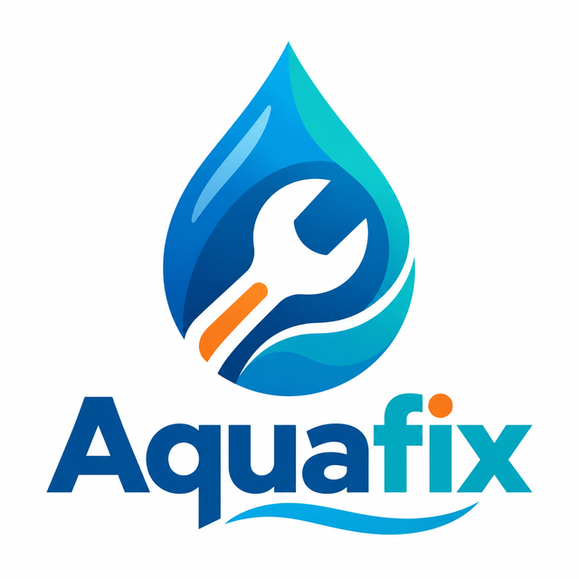
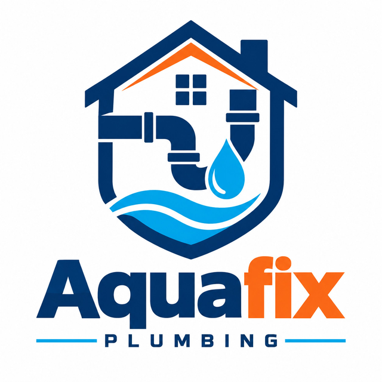
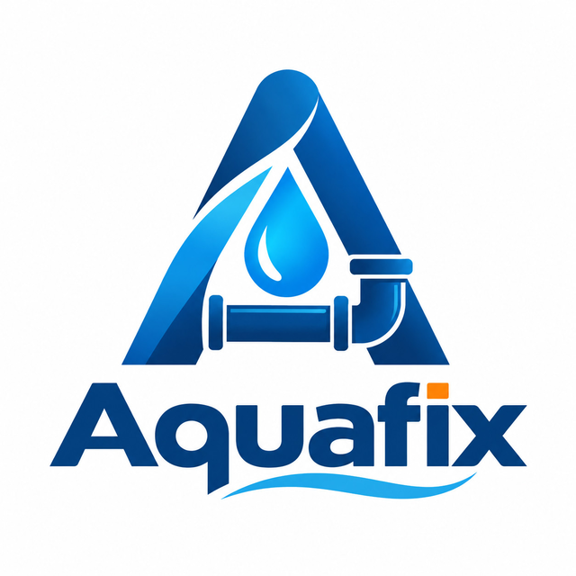
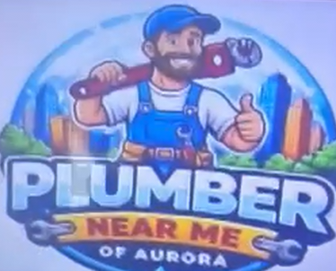

# Logos

The door sheet is the largest thing in the shot, and the mark on it is the only
object that says what the business does before a word is read. A letter in a ring
says nothing — a drop, a wrench, a length of pipe says plumber. Whoever reviews
the tape is checking that this door belongs to the trade it claims, so a generic
mark is worse than a loud one.

So `brand.logo` in `examples/brands/<brand>.typ` is a path from the repo root, and
the monogram in `typ/brand/lib.typ` is what draws when a brand has none.

## What the file has to be

The name is set in type beside the mark, so the file is the **emblem alone** — one
carrying its own wordmark prints the name twice. The card's front is navy, so the
background is transparent rather than white. Only the height is fixed when it is
placed; the proportion is the file's.

An SVG written with `fill="currentColor"` comes out in the brand's `accent`
wherever it lands, which is how one file serves the copper mark on the card back
and the copper mark on the poster. Anything else is drawn in its own colours.

## The ones we have

| | |
| --- | --- |
| [`/assets/logos/aquafix.svg`](../../assets/logos/aquafix.svg) | ours, and the only file here a build reads — a drop cut out of a hex, in `currentColor` |

The rest are references: what to aim a generator at, not files to import. Each is
a whole lock-up, so what to keep from one is the emblem above the wordmark.

| | |
| --- | --- |
|  | Two trade objects in one silhouette — the wrench is the negative space inside the drop. Reads at a corridor's distance, which the other two do not quite. |
|  | House, pipe, drop, wave. A domestic plumber rather than a plumber, which is what the descriptor line says in words. |
|  | The initial *is* the emblem — a monogram that took the trade on. The closest of the three to what the monogram would be if it could draw. |
|  | Mascot, skyline, ribbon, two wrenches. Nothing here is restrained and it is still the clearest of the four about the trade, which is the point: on a door, legible beats tasteful. |

## Supplied references

- `locksmith_keycraft_reference.jpeg`: house and key locksmith direction.
- `locksmith_securelock_reference.jpeg`: shield and key security direction.
- `locksmith_quickkey_reference.jpeg`: lock, key and speed direction.
- `locksmith_ironkey_reference.jpeg`: premium shield and key direction.
- `hvac_swiftair_reference.png`: house, airflow and heat/cool HVAC direction.
